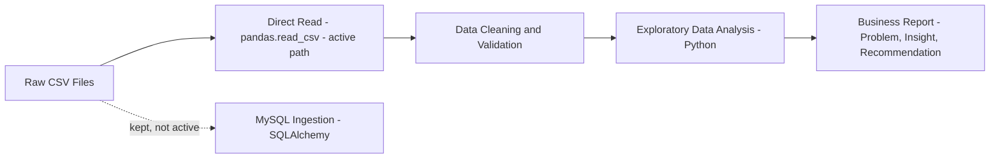

# InstaMart Market Basket Analysis


An end-to-end data analysis project on the InstaMart Market Basket dataset. It works through a specific set of business questions about customer ordering behavior, product performance, and reorder dynamics, and turns the findings into concrete recommendations rather than stopping at charts.

This README is meant to stand on its own: it covers the problem, the approach, how the data moves through the project, the folder structure, and the headline insights and recommendations, so that anyone looking at the repository gets the full picture without needing to open the report file.

---

## Table of Contents

- [Problem Statement](#problem-statement)
- [Dataset](#dataset)
- [Methodology and Approach](#methodology-and-approach)
- [Data Flow](#data-flow)
- [Tech Stack](#tech-stack)
- [Project Structure](#project-structure)
- [Analysis Sections](#analysis-sections)
- [Key Insights](#key-insights)
- [Recommendations](#recommendations)
- [Limitations and Future Work](#limitations-and-future-work)
- [Reports and Documentation](#reports-and-documentation)

---

## Problem Statement

A grocery ordering platform generates a large volume of order data, but that data on its own doesn't tell the business anything useful. Before any decision gets made on inventory, staffing, or retention spend, a few basic questions need real answers:

- Which products and categories actually drive order volume and deserve priority.
- How often customers order and how big their baskets tend to be.
- When demand genuinely peaks during the week.
- How much of the business runs on repeat purchases versus first-time purchases.
- Which categories deserve the most shelf space and marketing attention.

This project works through those questions using the raw order data and closes with a set of recommendations tied directly back to the findings. The full statement is also documented in `business_statement.txt`.

## Dataset

The analysis uses the InstaMart Market Basket dataset, structured as a star schema with one fact table and several dimension tables.

| Table | Description |
|---|---|
| `orders.csv` | Order-level metadata: order id, user id, day of week, hour of day, days since prior order |
| `order_products_prior.csv` | Fact table: order id, product id, cart position, reorder flag |
| `products.csv` | Product id, product name, aisle id, department id |
| `aisles.csv` | Aisle id, aisle name |
| `departments.csv` | Department id, department name |

The fact table contains tens of millions of order-item records, joined against the dimension tables for all category-level and aisle-level analysis.

## Methodology and Approach

1. **Data cleaning and validation** — null checks (including documenting expected nulls, such as a missing `days_since_prior_order` on a customer's first order), data type validation, duplicate checks on primary identifiers, and referential integrity checks across joined keys.
2. **Data access benchmarking** — two data access paths were built and compared: reading through a SQLAlchemy-managed MySQL connection versus reading the source CSV files directly with pandas. The direct-read path was measured to be substantially faster and was adopted as the active analysis path; the database ingestion path was kept in the codebase as a reusable, demonstrated capability.
3. **Exploratory data analysis** — conducted in Python using pandas for data manipulation and seaborn/matplotlib for visualization, organized into five thematic sections covering product performance, customer behavior, temporal patterns, reorder behavior, and category segmentation.
4. **Reporting** — findings were consolidated into a business-facing report connecting each analysis question to a specific, actionable recommendation.

## Data Flow



The direct-read path was chosen after benchmarking showed it to be roughly 85 percent faster than fetching the same data back out of MySQL. The MySQL ingestion path (`data_inhibition.py`) was kept in the codebase as a demonstrated, reusable capability, but it is not part of the active analysis path.

## Tech Stack

- **Python** — pandas for data manipulation, seaborn and matplotlib for visualization
- **MySQL** and **SQLAlchemy** — database ingestion path
- **Jupyter Notebook** — primary analysis environment

## Project Structure

```
.
│   .gitignore
│   business_statement.txt
│   README.md
│   requirement.txt
│   setup.py
│
├───Documents
│       hld_document.pdf
│       lld_documnet.pdf
│
├───Notebooks
│       instamart-ipnb(1).ipynb
│
├───Report
│       InstaMart_Business_Analysis_Report.pdf
│
└───src
        data_inhibition.py
        exception.py
        logger.py
        utilities.py
        __init__.py
```

| Path | Description |
|---|---|
| `business_statement.txt` | The business problem statement this project is built to answer. |
| `Documents/hld_document.pdf` | High-level design: system architecture and component responsibilities. |
| `Documents/lld_documnet.pdf` | Low-level design: detailed process flow and module-level breakdown. |
| `Notebooks/instamart-ipnb(1).ipynb` | The primary EDA notebook, organized into five sections with a chart and written insight for each business question. |
| `Report/InstaMart_Business_Analysis_Report.pdf` | The business-facing report: problem statement, insights, and recommendations for stakeholders. |
| `src/data_inhibition.py` | Loads the raw CSVs into MySQL. |
| `src/utilities.py` | Shared helper functions, including the SQLAlchemy engine setup used for database access and the direct pandas read path used for analysis. |
| `src/logger.py` | Centralized logging configuration used across ingestion and processing. |
| `src/exception.py` | Custom exception classes for pipeline-specific errors. |
| `setup.py` / `requirement.txt` | Package setup and dependencies. |

## Analysis Sections

The notebook is organized around five business questions, each broken into sub-questions with a supporting chart and a written insight:

1. **Product and Category Performance** — which products, aisles, and departments drive the most order volume, and whether high-volume categories also show high reorder rates.
2. **Customer Purchase Behavior** — distribution of orders per customer, average days between orders, and average basket size.
3. **Temporal and Seasonality Patterns** — order volume by day of week, by hour of day, and the combined day-hour relationship.
4. **Reorder Behavior** — the overall reorder rate, which products are reordered most and least, and whether cart position predicts reorder likelihood.
5. **Department and Aisle Segmentation** — ranking categories by total items sold and identifying the top products within each department.

---

## Key Insights

- Fifty-nine percent of all items ordered are reorders rather than first-time purchases. Repeat buying, not discovery, is the dominant behavior on the platform.
- Reorder rate is driven almost entirely by product perishability and consumption speed, not by price or category popularity. Milk, water, and fresh produce show reorder rates above 70 percent; spices and specialty baking items fall below 20 percent.
- High order volume and high reorder rate move together rather than in opposition. Produce, dairy and eggs, and beverages are simultaneously the highest-volume and highest-loyalty categories, with no category showing high volume paired with low reorder rate.
- Order volume is concentrated, not evenly distributed. Sunday and Monday account for a disproportionate share of weekly orders, and within each day, activity plateaus between 9 AM and 4 PM. The two effects compound: the single busiest window is the overlap of the top days and the peak hours.
- Reorder likelihood declines steadily by cart position, from roughly 68 percent on the first item added to about 44 percent by the thirtieth item, indicating customers add routine items first and discretionary items later in a shopping session.
- Most customers are light users. The largest customer segment has placed only four to six total orders, meaning retention strategy has more to gain from the broad base of occasional shoppers than from the small tail of already-loyal customers.

## Recommendations

- Prioritize inventory reliability for produce, dairy, and beverages. These categories carry both the highest order volume and the highest reorder rates, so a stockout here has a larger business impact than in any other category.
- Build subscription or auto-reorder features specifically around high-reorder staples such as milk, water, and produce. The same push on low-reorder categories such as spices is unlikely to be effective, since the underlying purchase behavior does not support it.
- Plan staffing and fulfillment capacity around the Sunday-Monday, 9 AM to 4 PM demand window specifically, rather than treating weekends or daytime hours as uniformly busy.
- Use two distinct reorder-reminder cadences, roughly weekly and roughly every three weeks, to match the two customer rhythms identified in the order-frequency data, rather than a single reminder schedule for all customers.
- Sequence in-app product suggestions to match observed cart behavior: surface routine, repeat items early in the shopping flow, and place discovery-oriented or new product recommendations later, when customers are more likely to be browsing.
- Direct retention efforts primarily at the large base of light and occasional customers rather than the already-loyal segment, since that is where the majority of the customer base, and the majority of untapped growth, currently sits.

## Limitations and Future Work

- This analysis is descriptive. It identifies patterns in historical order data and does not model or predict future customer behavior.
- The visible spike in orders-per-customer at exactly 100 orders is almost certainly a cap in how the dataset was constructed rather than a genuine behavioral ceiling, and likely understates true loyalty at the high end of the customer base.
- Market basket analysis, such as association rule mining to identify which products are frequently purchased together, was scoped out of this phase and is a natural next step.
- A cohort-based retention analysis, tracking what share of first-time customers return for a second, fifth, or tenth order, would extend this work from a descriptive analysis into a more predictive retention framework.

---

## Reports and Documentation

- **Business report** — `Report/InstaMart_Business_Analysis_Report.pdf`: problem statement, insights, and recommendations for stakeholders, with supporting charts for every finding.
- **High-level design** — `Documents/hld_document.pdf`: system architecture and component responsibilities.
- **Low-level design** — `Documents/lld_documnet.pdf`: detailed process flow and module-level breakdown.
- **Business problem statement** — `business_statement.txt`.
